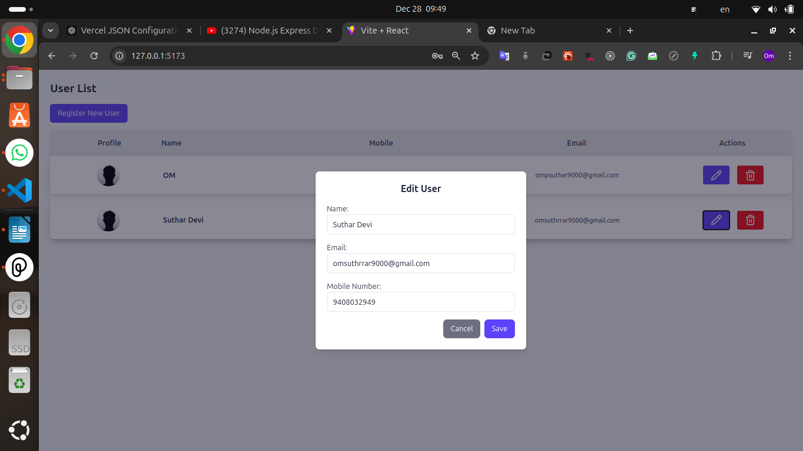

# MERN Registration API

This is a MERN stack application that allows users to register with their personal information and profile picture. The application provides API endpoints for user registration, viewing user data, updating user data, and deleting users. It also includes a front-end built with React.js for interacting with these APIs.

## Features

- **User Registration:** Allows users to register with personal details and profile picture.
- **View Registered Users:** Displays a list of registered users with options to view individual user details.
- **Update User Data:** Enables users to update their information.
- **Delete User:** Provides functionality to delete a user from the database.
- **Profile Picture Upload:** Supports profile picture uploads using Multer for handling file uploads.

## Requirements

Before running the application, ensure you have the following installed:

- **Node.js** (v16 or above)
- **MongoDB** (either locally or a cloud service like MongoDB Atlas)
- **npm** or **yarn** (for managing dependencies)
- **React.js** (for the front-end)

## Setup Instructions

### Backend Setup

1. Navigate to the backend directory:
   ```bash
   cd backend
2. Install dependencies using npm:
   ```bash
   npm install
3. Create a .env file in the backend directory and add the following values:
   ```bash
   PORT=3000
   DBURL="your_mongoodb_url/prectical_task"
   DBPASSWORD="your_mongodb_password"
   SERVER_BASE_URL="http://<your_local_ip>:3000"
   FRONTEND_URL="http://<your_local_ip>:port"
4. Start the backend server:
   ```bash
   npm run dev
   
### Frontend Setup
1. Navigate to the frontend directory:
   ```bash
   cd frontend
2. Install dependencies using npm:
   ```bash
   npm install
3. Create a .env file in the frontend directory and add the following values:
   ```bash
   VITE_API_URL="http://<your_local_ip>:3000"
4. Start the frontend server:
   ```bash
   npm run dev
### Important Note: The backend blocks requests from localhost due to CORS policy. Always use the format http://127.0.0.1:<port> instead of http://localhost:<port> for both the API URL and frontend base URL in your environment files. This ensures seamless communication between the frontend and backend.

## Screenshots

### User Registration


### User list


### User Update



